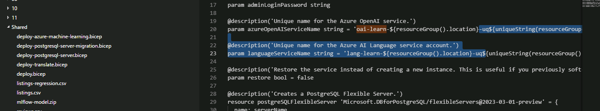

NOTE: Do not copy and paste directly into browser based cloud shell.
Paste all into notepad first, then copy/paste from there to the shell.

Be aware of extra or mising characters when you copy paste

I needed to edit the deploy.json file to uniquify the path

Labs:
Explore the Azure AI Extension
Can skip step 5, 1 subscription

Workaround on deployment, tring as powershell
$RG_NAME = "YourResourceGroupName"
$ADMIN_PASSWORD = "YourSecurePassword"

New-AzResourceGroupDeployment `
  -ResourceGroupName $RG_NAME `
  -TemplateFile "mslearn-postgresql\Allfiles\Labs\Shared\deploy.bicep" `
  -TemplateParameterObject @{
    restore = $false
    adminLogin = "pgAdmin"
    adminLoginPassword = $ADMIN_PASSWORD
  }