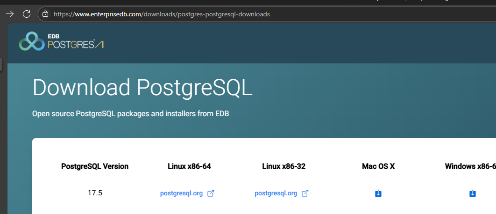
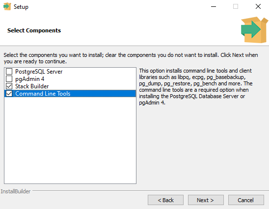

We are using the github repo to deploy lab environment, with some changes.
Optional Preparation:
    Have the users install VSCode and Postgres extension, nice to have but not required

We will use student#@obbinfotech.com

NOTE:Resourcegroup name to be modified with be prefixed student
So instead of rg-learn-postgresql-ai-$REGION
it is rg-student1-learn-postgresql-ai-$REGION

NOTE:save generated password in a text doc

Install VSCODE with Postgres extension and psql, yes, testing with this, guidance is heree:
https://microsoftlearning.github.io/mslearn-postgresql/Instructions/Labs/02-exercise-explore-client-tools.html
psql support may be awkward to set up, better stick with cloud shell?

(Optional) Need VSCode plus psql, installed latest version PostGreSQL for windows from here:

I only selected last 2 options as I only need client tools:

It needs to be added to path, so I rane in PowerShell
$env:Path += ";C:\Program Files\PostgreSQL\17\bin\"

connected to rental database starting with 
https://microsoftlearning.github.io/mslearn-postgresql/Instructions/Labs/13-generate-vector-embeddings-azure-openai.html

Optionally enable both extensions as described
https://learn.microsoft.com/en-us/azure/postgresql/extensions/how-to-allow-extensions?tabs=allow-extensions-portal#how-to-use-postgresql-extensions

Finished all the steps
Starting next lab, can skip up to:
https://microsoftlearning.github.io/mslearn-postgresql/Instructions/Labs/13-generate-vector-embeddings-azure-openai.html#create-and-store-embedding-vectors